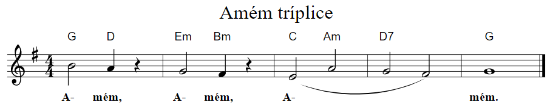

# Novo Cântico - Cifras
Há na internet um arquivo com as cifras dos hinos do **Novo Cântico** que, por vários anos, tem auxiliado a igreja no uso do hinário. Contudo, esse documento tem alguns problemas:

* diagramação inapropriada que causa a separação de versos e estrofes em colunas e páginas diferentes,
* posicionamento incorreto de acordes e
* acordes incorretos.

O propósito deste repositório é disponibilizar os hinos com cifras de forma estruturada e sem os problemas citados. As referências usadas são o próprio [Hinário Novo Cântico com partituras](https://www.editoraculturacrista.com.br/hinario-novo-cantico-com-partitura-sem-cifras.html) e um conjunto de cadernos que a [Editora Cultura Cristã](https://www.editoraculturacrista.com.br/) publicou a partir de 2003 com “pautas dos hinos com melodias e cifras facilitadas para acompanhamento”.

Os hinos são representados textualmente com a [notação ABC](http://abcnotation.com/).

## Exemplo



```
X:400A
T:Amém tríplice
M:4/4
L:1/4
K:G
"G" B2 "D" A z | "Em" G2 "Bm" F z | ("C" E2 "Am" A2 | "D7" G2 F2) | "G" G4 |]
```